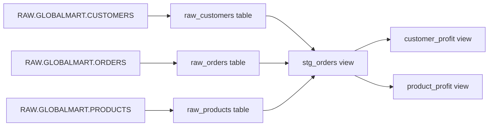

# Luồng dữ liệu

```mermaid
flowchart LR
    C[RAW.GLOBALMART.CUSTOMERS] --> RC[raw_customers table]
    O[RAW.GLOBALMART.ORDERS] --> RO[raw_orders table]
    P[RAW.GLOBALMART.PRODUCTS] --> RP[raw_products table]
    RC --> S[stg_orders view]
    RO --> S
    RP --> S
    S --> CP[customer_profit view]
    S --> PP[product_profit view]
```

Lineage thực tế của dbt được tạo bằng `dbt docs generate`, sau khi kết nối Snowflake.
